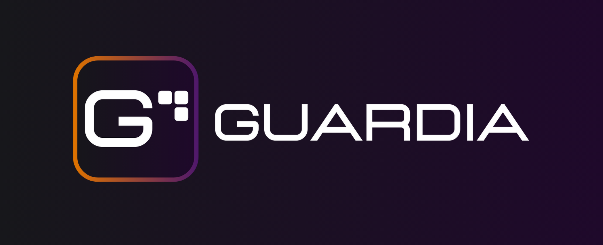

# Bem-vindo ao início. Bem-vindo à Guardia. Aproveite a jornada!

## Construindo a próxima geração de infraestrutura para fintechs.

Na Guardia, potencializamos fintechs a criar e operar produtos financeiros com **autonomia**, **segurança** e **eficiência**, do MVP ao scaleup.

Somos uma plataforma de infraestrutura bancária **Cloud Native**, **Open Source** e **Powered by AI**, projetada para quem precisa escalar com confiança desde o primeiro deploy. Colocamos o controle nas mãos de quem constrói o futuro das finanças.

Nossa visão é sermos a **primeira escolha** de cada fintech quando buscam maximizar resultados ao operar e escalar sua infraestrutura bancária.

## Projetos em destaque

## Comunidade

Acesso o Developer Hub da Guardia em: [https://hub.guardia.finance](https://hub.guardia.finance)

Faca parte de nossa comunidade no Slack e WhatsApp (em breve).

---

