import MermaidDiagram from '@site/src/components/MermaidDiagram';

# Entities and Relationships

## Control Schema

The control schema is the schema that contains the references of all other schemas.

```mermaid
erDiagram
    %%{init: {'theme': 'neutral'}}%%

    LEDGER ||--o{ LEDGER_HISTORY : tracks

    LEDGER {
        uuid entity_id PK "Field controlled by the application. UUID v7, with temporal ordering."
        string external_entity_id "Unique identifier for interoperability with other systems. Maximum length: 36 characters."
        string name "Unique within the organization and tenant. Maximum length: 128 characters."
        string description "Description for reporting purposes. Maximum length: 256 characters."
        timestamp created_at "Date of insertion into the database."
        timestamp updated_at "Date of last update in the database."
        timestamp discarded_at "Date of deletion in the database. Must implement soft delete standard."
        hstore metadata "Additional metadata for interoperability with other systems. Maximum size: 4KB."
        int version "Field controlled by the application. Must be incremented by 1 each time the entity is changed."
        timestampz valid_from "Field indicating the start of the validity period of this entity version."
        timestampz valid_to "Field indicating the end of the validity period of this entity version. Default: 12/31/9999 23:59:59."
    }

    LEDGER_HISTORY {
        uuid entity_id PK "Field controlled by the application. UUID v7, with temporal ordering."
        string external_entity_id "Unique identifier for interoperability with other systems. Maximum length: 36 characters."
        string name "Unique within the organization and tenant. Maximum length: 128 characters."
        string description "Description for reporting purposes. Maximum length: 256 characters."
        timestamp created_at "Date of insertion into the database."
        timestamp updated_at "Date of last update in the database."
        timestamp discarded_at "Date of deletion in the database. Must implement soft delete standard."
        hstore metadata "Additional metadata for interoperability with other systems. Maximum size: 4KB."
        int version "Field controlled by the application. Must be incremented by 1 each time the entity is changed."
        timestampz valid_from "Field indicating the start of the validity period of this entity version."
        timestampz valid_to "Field indicating the end of the validity period of this entity version."
    }

    ASSET ||--o{ ASSET_HISTORY : tracks
    ASSET {
        uuid entity_id PK "Field controlled by the application. UUID v7, with temporal ordering."
        string external_entity_id "Unique identifier for interoperability with other systems. Maximum length: 36 characters."
        string classification "Asset classification. Must be FIAT or NON_FIAT."
        string denomination_code "Representative code of the asset. Must be an ISO 4217 code."
        string denomination_number "ISO number or identifier of the asset. Must be an ISO 4217 number."
        int denomination_exponent "Decimal scale of the asset. Must be an integer between 0 and 18."
        hstore metadata "Additional metadata for interoperability with other systems. Maximum size: 4KB."
        timestamp created_at "Date of insertion into the database."
        timestamp updated_at "Date of last update in the database."
        timestamp discarded_at "Date of deletion in the database. Must implement soft delete standard."
        int version "Field controlled by the application. Must be incremented by 1 each time the entity is changed."
        timestampz valid_from "Field indicating the start of the validity period of this entity version."
        timestampz valid_to "Field indicating the end of the validity period of this entity version. Default: 12/31/9999 23:59:59."
    }

    ASSET_HISTORY {
        uuid entity_id PK "Field controlled by the application. UUID v7, with temporal ordering."
        string external_entity_id "Unique identifier for interoperability with other systems. Maximum length: 36 characters."
        uuid ledger_id "Reference to LEDGER."
        string classification "Asset classification. Must be FIAT or NON_FIAT."
        string denomination_code "Representative code of the asset. Must be an ISO 4217 code."
        string denomination_number "ISO number or identifier of the asset. Must be an ISO 4217 number."
        int denomination_exponent "Decimal scale of the asset. Must be an integer between 0 and 18."
        timestamp created_at "Date of insertion into the database."
        timestamp updated_at "Date of last update in the database."
        timestamp discarded_at "Date of deletion in the database. Must implement soft delete standard."
        int version "Field controlled by the application. Must be incremented by 1 each time the entity is changed."
        timestampz valid_from "Field indicating the start of the validity period of this entity version."
        timestampz valid_to "Field indicating the end of the validity period of this entity version."
    }

    LEDGER ||--o{ BOUND_ASSET : has
    ASSET ||--o{ BOUND_ASSET : has
    BOUND_ASSET ||--o{ BOUND_ASSET_HISTORY : tracks
    BOUND_ASSET {
        uuid ledger_entity_id FK "Reference to LEDGER."
        uuid asset_entity_id FK "Relationship with ASSET."
        string denomination_code "Representative code of the asset. Must be an ISO 4217 code."
        string denomination_number "ISO number or identifier of the asset. Must be an ISO 4217 number."
        int denomination_exponent "Decimal scale of the asset. Must be an integer between 0 and 18."
        array denomination_locations "Regions where the asset is accepted as currency. Must be an array of ISO 3166-2 codes."
        timestamp created_at "Date of insertion into the database."
        timestamp updated_at "Date of last update in the database."
        int version "Field controlled by the application. Must be incremented by 1 each time the entity is changed."
        timestampz valid_from "Field indicating the start of the validity period of this entity version."
        timestampz valid_to "Field indicating the end of the validity period of this entity version."
    }

    BOUND_ASSET_HISTORY {
        uuid ledger_entity_id FK "Reference to LEDGER."
        uuid asset_entity_id FK "Relationship with ASSET."
        string denomination_code "Representative code of the asset. Must be an ISO 4217 code."
        string denomination_number "ISO number or identifier of the asset. Must be an ISO 4217 number."
        int denomination_exponent "Decimal scale of the asset. Must be an integer between 0 and 18."
        array denomination_locations "Regions where the asset is accepted as currency. Must be an array of ISO 3166-2 codes."
        timestamp created_at "Date of insertion into the database."
        timestamp updated_at "Date of last update in the database."
        int version "Field controlled by the application. Must be incremented by 1 each time the entity is changed."
        timestampz valid_from "Field indicating the start of the validity period of this entity version."
        timestampz valid_to "Field indicating the end of the validity period of this entity version."
    }

```

<MermaidDiagram>

</MermaidDiagram>

## General Schema

The general schema is the central ledger schema used in the triple-entry system. In this schema, the temporal records of transactions, entries, and positions are recorded in triple-entry format.

<MermaidDiagram>

</MermaidDiagram>

## Transactional Schema

Each ledger is associated with a transactional schema. In addition to the temporal record of each entity, the transactional schema records the history of each entity.

<MermaidDiagram>

</MermaidDiagram>
