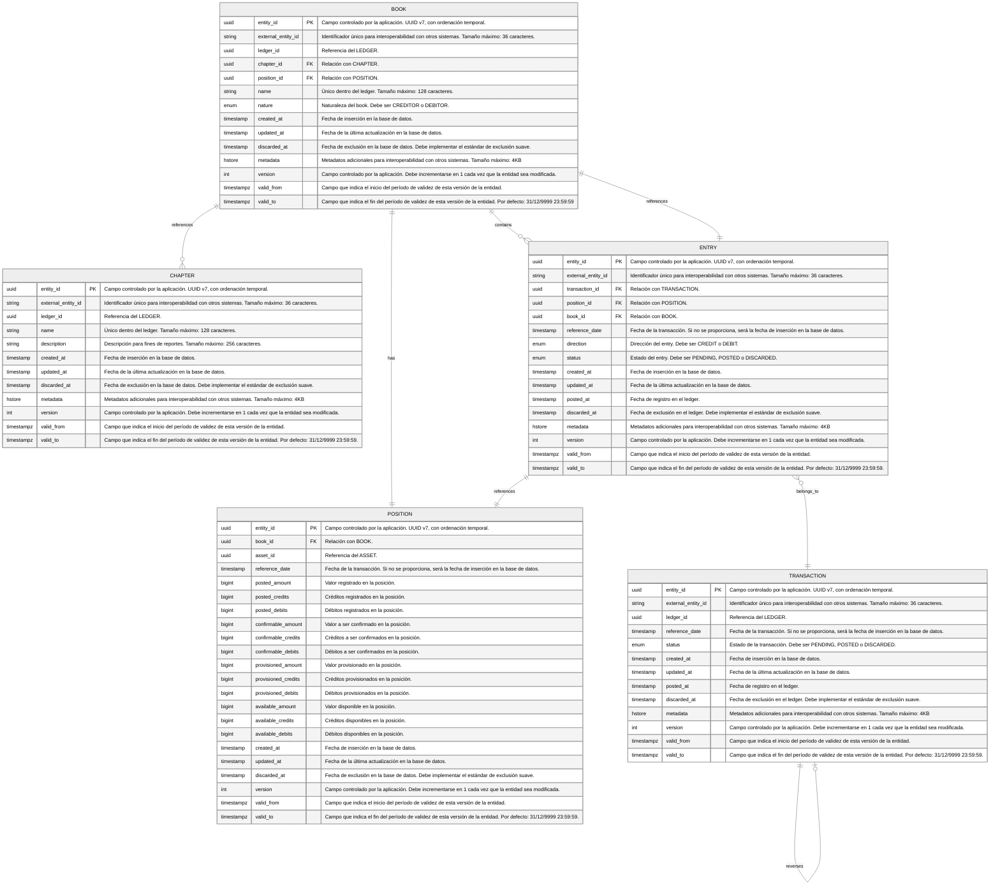

import MermaidDiagram from '@site/src/components/MermaidDiagram';

# Entidades y Relaciones

## Schema Control

El esquema de control es el esquema que contiene las referencias de todos los demás esquemas.

```mermaid
erDiagram
    %%{init: {'theme': 'neutral'}}%%

    LEDGER ||--o{ LEDGER_HISTORY : tracks

    LEDGER {
        uuid entity_id PK "Campo controlado por la aplicación. UUID v7, con ordenación temporal."
        string external_entity_id "Identificador único para interoperabilidad con otros sistemas. Tamaño máximo: 36 caracteres."
        string name "Único dentro de la organización y tenant. Tamaño máximo: 128 caracteres."
        string description "Descripción para fines de reportes. Tamaño máximo: 256 caracteres."
        timestamp created_at "Fecha de inserción en la base de datos."
        timestamp updated_at "Fecha de la última actualización en la base de datos."
        timestamp discarded_at "Fecha de exclusión en la base de datos. Debe implementar el estándar de exclusión suave."
        hstore metadata "Metadatos adicionales para interoperabilidad con otros sistemas. Tamaño máximo: 4KB"
        int version "Campo controlado por la aplicación. Debe incrementarse en 1 cada vez que la entidad sea modificada."
        timestampz valid_from "Campo que indica el inicio del período de validez de esta versión de la entidad."
        timestampz valid_to "Campo que indica el fin del período de validez de esta versión de la entidad. Por defecto: 31/12/9999 23:59:59."
    }

    LEDGER_HISTORY {
        uuid entity_id PK "Campo controlado por la aplicación. UUID v7, con ordenación temporal."
        string external_entity_id "Identificador único para interoperabilidad con otros sistemas. Tamaño máximo: 36 caracteres."
        string name "Único dentro de la organización y tenant. Tamaño máximo: 128 caracteres."
        string description "Descripción para fines de reportes. Tamaño máximo: 256 caracteres."
        timestamp created_at "Fecha de inserción en la base de datos."
        timestamp updated_at "Fecha de la última actualización en la base de datos."
        timestamp discarded_at "Fecha de exclusión en la base de datos. Debe implementar el estándar de exclusión suave."
        hstore metadata "Metadatos adicionales para interoperabilidad con otros sistemas. Tamaño máximo: 4KB"
        int version "Campo controlado por la aplicación. Debe incrementarse en 1 cada vez que la entidad sea modificada."
        timestampz valid_from "Campo que indica el inicio del período de validez de esta versión de la entidad."
        timestampz valid_to "Campo que indica el fin del período de validez de esta versión de la entidad."
    }

    ASSET ||--o{ ASSET_HISTORY : tracks
    ASSET {
        uuid entity_id PK "Campo controlado por la aplicación. UUID v7, con ordenación temporal."
        string external_entity_id "Identificador único para interoperabilidad con otros sistemas. Tamaño máximo: 36 caracteres."
        string classification "Clasificación del asset. Debe ser FIAT o NON_FIAT."
        string denomination_code "Código representativo del asset. Debe ser un código ISO 4217."
        string denomination_number "Número ISO o identificador del asset. Debe ser un número ISO 4217."
        int denomination_exponent "Escala decimal del asset. Debe ser un número entero entre 0 y 18."
        hstore metadata "Metadatos adicionales para interoperabilidad con otros sistemas. Tamaño máximo: 4KB"
        timestamp created_at "Fecha de inserción en la base de datos."
        timestamp updated_at "Fecha de la última actualización en la base de datos."
        timestamp discarded_at "Fecha de exclusión en la base de datos. Debe implementar el estándar de exclusión suave."
        int version "Campo controlado por la aplicación. Debe incrementarse en 1 cada vez que la entidad sea modificada."
        timestampz valid_from "Campo que indica el inicio del período de validez de esta versión de la entidad."
        timestampz valid_to "Campo que indica el fin del período de validez de esta versión de la entidad. Por defecto: 31/12/9999 23:59:59."
    }

    ASSET_HISTORY {
        uuid entity_id PK "Campo controlado por la aplicación. UUID v7, con ordenación temporal."
        string external_entity_id "Identificador único para interoperabilidad con otros sistemas. Tamaño máximo: 36 caracteres."
        uuid ledger_id "Referencia del LEDGER."
        string classification "Clasificación del asset. Debe ser FIAT o NON_FIAT."
        string denomination_code "Código representativo del asset. Debe ser un código ISO 4217."
        string denomination_number "Número ISO o identificador del asset. Debe ser un número ISO 4217."
        int denomination_exponent "Escala decimal del asset. Debe ser un número entero entre 0 y 18."
        timestamp created_at "Fecha de inserción en la base de datos."
        timestamp updated_at "Fecha de la última actualización en la base de datos."
        timestamp discarded_at "Fecha de exclusión en la base de datos. Debe implementar el estándar de exclusión suave."
        int version "Campo controlado por la aplicación. Debe incrementarse en 1 cada vez que la entidad sea modificada."
        timestampz valid_from "Campo que indica el inicio del período de validez de esta versión de la entidad."
        timestampz valid_to "Campo que indica el fin del período de validez de esta versión de la entidad."
    }

    LEDGER ||--o{ BOUND_ASSET : has
    ASSET ||--o{ BOUND_ASSET : has
    BOUND_ASSET ||--o{ BOUND_ASSET_HISTORY : tracks
    BOUND_ASSET {
        uuid ledger_entity_id FK "Referencia del LEDGER."
        uuid asset_entity_id FK "Relación con ASSET."
        string denomination_code "Código representativo del asset. Debe ser un código ISO 4217."
        string denomination_number "Número ISO o identificador del asset. Debe ser un número ISO 4217."
        int denomination_exponent "Escala decimal del asset. Debe ser un número entero entre 0 y 18."
        array denomination_locations "Regiones donde el asset es aceptado como moneda de cambio. Debe ser un array de códigos ISO 3166-2."
        timestamp created_at "Fecha de inserción en la base de datos."
        timestamp updated_at "Fecha de la última actualización en la base de datos."
        int version "Campo controlado por la aplicación. Debe incrementarse en 1 cada vez que la entidad sea modificada."
        timestampz valid_from "Campo que indica el inicio del período de validez de esta versión de la entidad."
        timestampz valid_to "Campo que indica el fin del período de validez de esta versión de la entidad."
    }

    BOUND_ASSET_HISTORY {
        uuid ledger_entity_id FK "Referencia del LEDGER."
        uuid asset_entity_id FK "Relación con ASSET."
        string denomination_code "Código representativo del asset. Debe ser un código ISO 4217."
        string denomination_number "Número ISO o identificador del asset. Debe ser un número ISO 4217."
        int denomination_exponent "Escala decimal del asset. Debe ser un número entero entre 0 y 18."
        array denomination_locations "Regiones donde el asset es aceptado como moneda de cambio. Debe ser un array de códigos ISO 3166-2."
        timestamp created_at "Fecha de inserción en la base de datos."
        timestamp updated_at "Fecha de la última actualización en la base de datos."
        int version "Campo controlado por la aplicación. Debe incrementarse en 1 cada vez que la entidad sea modificada."
        timestampz valid_from "Campo que indica el inicio del período de validez de esta versión de la entidad."
        timestampz valid_to "Campo que indica el fin del período de validez de esta versión de la entidad."
    }

```

<MermaidDiagram>

</MermaidDiagram>

## Schema General

El esquema general es el esquema del ledger central usado en el sistema de partidas triples. En este esquema se registran, en formato de partida triple, el registro temporal de las transacciones, entradas y posiciones.

<MermaidDiagram>

</MermaidDiagram>

## Schema Transaccional

Cada ledger está asociado a un schema transaccional. Además del registro temporal de cada entidad, el schema transaccional registra el historial de cada entidad.

```mermaid
erDiagram
    %%{init: {'theme': 'neutral'}}%%

    CHAPTER ||--o{ CHAPTER_HISTORY : tracks
    CHAPTER {
        uuid entity_id PK "Campo controlado por la aplicación. UUID v7, con ordenación temporal."
        string external_entity_id "Identificador único para interoperabilidad con otros sistemas. Tamaño máximo: 36 caracteres."
        uuid ledger_id "Referencia del LEDGER."
        string name "Único dentro del ledger. Tamaño máximo: 128 caracteres."
        string description "Descripción para fines de reportes. Tamaño máximo: 256 caracteres."
        timestamp created_at "Fecha de inserción en la base de datos."
        timestamp updated_at "Fecha de la última actualización en la base de datos."
        timestamp discarded_at "Fecha de exclusión en la base de datos. Debe implementar el estándar de exclusión suave."
        hstore metadata "Metadatos adicionales para interoperabilidad con otros sistemas. Tamaño máximo: 4KB"
        int version "Campo controlado por la aplicación. Debe incrementarse en 1 cada vez que la entidad sea modificada."
        timestampz valid_from "Campo que indica el inicio del período de validez de esta versión de la entidad."
        timestampz valid_to "Campo que indica el fin del período de validez de esta versión de la entidad. Por defecto: 31/12/9999 23:59:59."
    }

    CHAPTER_HISTORY {
        uuid entity_id PK "Campo controlado por la aplicación. UUID v7, con ordenación temporal."
        string external_entity_id "Identificador único para interoperabilidad con otros sistemas. Tamaño máximo: 36 caracteres."
        uuid ledger_id "Referencia del LEDGER."
        string name "Único dentro del ledger. Tamaño máximo: 128 caracteres."
        string description "Descripción para fines de reportes. Tamaño máximo: 256 caracteres."
        timestamp created_at "Fecha de inserción en la base de datos."
        timestamp updated_at "Fecha de la última actualización en la base de datos."
        timestamp discarded_at "Fecha de exclusión en la base de datos. Debe implementar el estándar de exclusión suave."
        hstore metadata "Metadatos adicionales para interoperabilidad con otros sistemas. Tamaño máximo: 4KB"
        int version "Campo controlado por la aplicación. Debe incrementarse en 1 cada vez que la entidad sea modificada."
        timestampz valid_from "Campo que indica el inicio del período de validez de esta versión de la entidad."
        timestampz valid_to "Campo que indica el fin del período de validez de esta versión de la entidad."
    }

    BOOK ||--o{ ENTRY : contains
    BOOK ||--|| POSITION : has
    BOOK ||--o{ CHAPTER : references
    BOOK ||--o{ BOOK_HISTORY : tracks
    BOOK {
        uuid entity_id PK "Campo controlado por la aplicación. UUID v7, con ordenación temporal."
        string external_entity_id "Identificador único para interoperabilidad con otros sistemas. Tamaño máximo: 36 caracteres."
        uuid ledger_id "Referencia del LEDGER."
        uuid chapter_id FK "Relación con CHAPTER."
        uuid position_id FK "Relación con POSITION."
        string name "Único dentro del ledger. Tamaño máximo: 128 caracteres."
        enum nature "Naturaleza del book. Debe ser CREDITOR o DEBITOR."
        timestamp created_at "Fecha de inserción en la base de datos."
        timestamp updated_at "Fecha de la última actualización en la base de datos."
        timestamp discarded_at "Fecha de exclusión en la base de datos. Debe implementar el estándar de exclusión suave."
        hstore metadata "Metadatos adicionales para interoperabilidad con otros sistemas. Tamaño máximo: 4KB"
        int version "Campo controlado por la aplicación. Debe incrementarse en 1 cada vez que la entidad sea modificada."
        timestampz valid_from "Campo que indica el inicio del período de validez de esta versión de la entidad."
        timestampz valid_to "Campo que indica el fin del período de validez de esta versión de la entidad. Por defecto: 31/12/9999 23:59:59"
    }

    BOOK_HISTORY {
        uuid entity_id PK "Campo controlado por la aplicación. UUID v7, con ordenación temporal."
        string external_entity_id "Identificador único para interoperabilidad con otros sistemas. Tamaño máximo: 36 caracteres."
        uuid ledger_id "Referencia del LEDGER."
        uuid chapter_id FK "Relación con CHAPTER."
        uuid position_id FK "Relación con POSITION."
        string name "Único dentro del ledger. Tamaño máximo: 128 caracteres."
        enum nature "Naturaleza del book. Debe ser CREDITOR o DEBITOR."
        timestamp created_at "Fecha de inserción en la base de datos."
        timestamp updated_at "Fecha de la última actualización en la base de datos."
        timestamp discarded_at "Fecha de exclusión en la base de datos. Debe implementar el estándar de exclusión suave."
        hstore metadata "Metadatos adicionales para interoperabilidad con otros sistemas. Tamaño máximo: 4KB"
        int version "Campo controlado por la aplicación. Debe incrementarse en 1 cada vez que la entidad sea modificada."
        timestampz valid_from "Campo que indica el inicio del período de validez de esta versión de la entidad."
        timestampz valid_to "Campo que indica el fin del período de validez de esta versión de la entidad."
    }

    POSITION ||--o{ POSITION_HISTORY : tracks
    POSITION {
        uuid entity_id PK "Campo controlado por la aplicación. UUID v7, con ordenación temporal."
        uuid book_id FK "Relación con BOOK."
        uuid asset_id "Referencia del ASSET."
        timestamp reference_date "Fecha de la transacción. Si no se proporciona, será la fecha de inserción en la base de datos."
        bigint posted_amount "Valor registrado en la posición."
        bigint posted_credits "Créditos registrados en la posición."
        bigint posted_debits "Débitos registrados en la posición."
        bigint confirmable_amount "Valor a ser confirmado en la posición."
        bigint confirmable_credits "Créditos a ser confirmados en la posición."
        bigint confirmable_debits "Débitos a ser confirmados en la posición."
        bigint provisioned_amount "Valor provisionado en la posición."
        bigint provisioned_credits "Créditos provisionados en la posición."
        bigint provisioned_debits "Débitos provisionados en la posición."
        bigint available_amount "Valor disponible en la posición."
        bigint available_credits "Créditos disponibles en la posición."
        bigint available_debits "Débitos disponibles en la posición."
        timestamp created_at "Fecha de inserción en la base de datos."
        timestamp updated_at "Fecha de la última actualización en la base de datos."
        timestamp discarded_at "Fecha de exclusión en la base de datos. Debe implementar el estándar de exclusión suave."
        int version "Campo controlado por la aplicación. Debe incrementarse en 1 cada vez que la entidad sea modificada."
        timestampz valid_from "Campo que indica el inicio del período de validez de esta versión de la entidad."
        timestampz valid_to "Campo que indica el fin del período de validez de esta versión de la entidad. Por defecto: 31/12/9999 23:59:59."
    }

    POSITION_HISTORY {
        uuid entity_id PK "Campo controlado por la aplicación. UUID v7, con ordenación temporal."
        string external_entity_id "Identificador único para interoperabilidad con otros sistemas. Tamaño máximo: 36 caracteres."
        uuid book_id FK "Relación con BOOK."
        uuid asset_id FK "Relación con ASSET."
        timestamp reference_date "Fecha de la transacción. Si no se proporciona, será la fecha de inserción en la base de datos."
        bigint posted_amount "Valor total registrado en la posición."
        bigint posted_credits "Créditos totales registrados en la posición."
        bigint posted_debits "Débitos totales registrados en la posición."
        bigint confirmable_amount "Valor total a ser confirmado en la posición."
        bigint confirmable_credits "Total de créditos a ser confirmados en la posición."
        bigint confirmable_debits "Total de débitos a ser confirmados en la posición."
        bigint provisioned_amount "Valor total provisionado (registrado y confirmado) en la posición."
        bigint provisioned_credits "Total de créditos provisionados (registrado y confirmado) en la posición."
        bigint provisioned_debits "Total de débitos provisionados en la posición."
        bigint available_amount "Valor total disponible en la posición."
        bigint available_credits "Total de créditos disponibles en la posición."
        bigint available_debits "Total de débitos disponibles en la posición."
        timestamp created_at "Fecha de inserción en la base de datos."
        timestamp updated_at "Fecha de la última actualización en la base de datos."
        timestamp discarded_at "Fecha de exclusión en la base de datos. Debe implementar el estándar de exclusión suave."
        int version "Campo controlado por la aplicación. Debe incrementarse en 1 cada vez que la entidad sea modificada."
        timestampz valid_from "Campo que indica el inicio del período de validez de esta versión de la entidad."
        timestampz valid_to "Campo que indica el fin del período de validez de esta versión de la entidad."
    }

    ENTRY }o--|| TRANSACTION : belongs_to
    ENTRY ||--|| POSITION : references
    ENTRY ||--|| BOOK : references
    ENTRY ||--o{ ENTRY_HISTORY : tracks
    ENTRY {
        uuid entity_id PK "Campo controlado por la aplicación. UUID v7, con ordenación temporal."
        string external_entity_id "Identificador único para interoperabilidad con otros sistemas. Tamaño máximo: 36 caracteres."
        uuid transaction_id FK "Relación con TRANSACTION."
        uuid position_id FK "Relación con POSITION."
        uuid book_id FK "Relación con BOOK."
        timestamp reference_date "Fecha de la transacción. Si no se proporciona, será la fecha de inserción en la base de datos."
        enum direction "Dirección del entry. Debe ser CREDIT o DEBIT."
        enum status "Estado del entry. Debe ser PENDING, POSTED o DISCARDED."
        timestamp created_at "Fecha de inserción en la base de datos."
        timestamp updated_at "Fecha de la última actualización en la base de datos."
        timestamp posted_at "Fecha de registro en el ledger."
        timestamp discarded_at "Fecha de exclusión en el ledger. Debe implementar el estándar de exclusión suave."
        hstore metadata "Metadatos adicionales para interoperabilidad con otros sistemas. Tamaño máximo: 4KB"
        int version "Campo controlado por la aplicación. Debe incrementarse en 1 cada vez que la entidad sea modificada."
        timestampz valid_from "Campo que indica el inicio del período de validez de esta versión de la entidad."
        timestampz valid_to "Campo que indica el fin del período de validez de esta versión de la entidad. Por defecto: 31/12/9999 23:59:59."
    }

    ENTRY_HISTORY {
        uuid entity_id PK "Campo controlado por la aplicación. UUID v7, con ordenación temporal."
        string external_entity_id "Identificador único para interoperabilidad con otros sistemas. Tamaño máximo: 36 caracteres."
        uuid transaction_id FK "Relación con TRANSACTION."
        uuid position_id FK "Relación con POSITION."
        uuid book_id FK "Relación con BOOK."
        timestamp reference_date "Fecha de la transacción. Si no se proporciona, será la fecha de inserción en la base de datos."
        enum direction "Dirección del entry. Debe ser CREDIT o DEBIT."
        enum status "Estado del entry. Debe ser PENDING, POSTED o DISCARDED."
        timestamp created_at "Fecha de inserción en la base de datos."
        timestamp updated_at "Fecha de la última actualización en la base de datos."
        timestamp posted_at "Fecha de registro en el ledger."
        timestamp discarded_at "Fecha de exclusión en el ledger. Debe implementar el estándar de exclusión suave."
        hstore metadata "Metadatos adicionales para interoperabilidad con otros sistemas. Tamaño máximo: 4KB"
        int version "Campo controlado por la aplicación. Debe incrementarse en 1 cada vez que la entidad sea modificada."
        timestampz valid_from "Campo que indica el inicio del período de validez de esta versión de la entidad."
        timestampz valid_to "Campo que indica el fin del período de validez de esta versión de la entidad."
    }

    TRANSACTION ||--o| TRANSACTION : reverses
    TRANSACTION ||--o{ TRANSACTION_HISTORY : tracks
    TRANSACTION {
        uuid entity_id PK "Campo controlado por la aplicación. UUID v7, con ordenación temporal."
        string external_entity_id "Identificador único para interoperabilidad con otros sistemas. Tamaño máximo: 36 caracteres."
        uuid ledger_id "Referencia del LEDGER."
        timestamp reference_date "Fecha de la transacción. Si no se proporciona, será la fecha de inserción en la base de datos."
        enum status "Estado de la transacción. Debe ser PENDING, POSTED o DISCARDED."
        timestamp created_at "Fecha de inserción en la base de datos."
        timestamp updated_at "Fecha de la última actualización en la base de datos."
        timestamp posted_at "Fecha de registro en el ledger."
        timestamp discarded_at "Fecha de exclusión en el ledger. Debe implementar el estándar de exclusión suave."
        hstore metadata "Metadatos adicionales para interoperabilidad con otros sistemas. Tamaño máximo: 4KB"
        int version "Campo controlado por la aplicación. Debe incrementarse en 1 cada vez que la entidad sea modificada."
        timestampz valid_from "Campo que indica el inicio del período de validez de esta versión de la entidad."
        timestampz valid_to "Campo que indica el fin del período de validez de esta versión de la entidad. Por defecto: 31/12/9999 23:59:59."
    }

    TRANSACTION_HISTORY {
        uuid entity_id PK "Campo controlado por la aplicación. UUID v7, con ordenación temporal."
        string external_entity_id "Identificador único para interoperabilidad con otros sistemas. Tamaño máximo: 36 caracteres."
        uuid ledger_id "Referencia del LEDGER."
        timestamp reference_date "Fecha de la transacción. Si no se proporciona, será la fecha de inserción en la base de datos."
        enum status "Estado de la transacción. Debe ser PENDING, POSTED o DISCARDED."
        timestamp created_at "Fecha de inserción en la base de datos."
        timestamp updated_at "Fecha de la última actualización en la base de datos."
        timestamp posted_at "Fecha de registro en el ledger."
        timestamp discarded_at "Fecha de exclusión en el ledger. Debe implementar el estándar de exclusión suave."
        hstore metadata "Metadatos adicionales para interoperabilidad con otros sistemas. Tamaño máximo: 4KB"
        int version "Campo controlado por la aplicación. Debe incrementarse en 1 cada vez que la entidad sea modificada."
        timestampz valid_from "Campo que indica el inicio del período de validez de esta versión de la entidad."
        timestampz valid_to "Campo que indica el fin del período de validez de esta versión de la entidad."
    }
```

<MermaidDiagram>

</MermaidDiagram>
